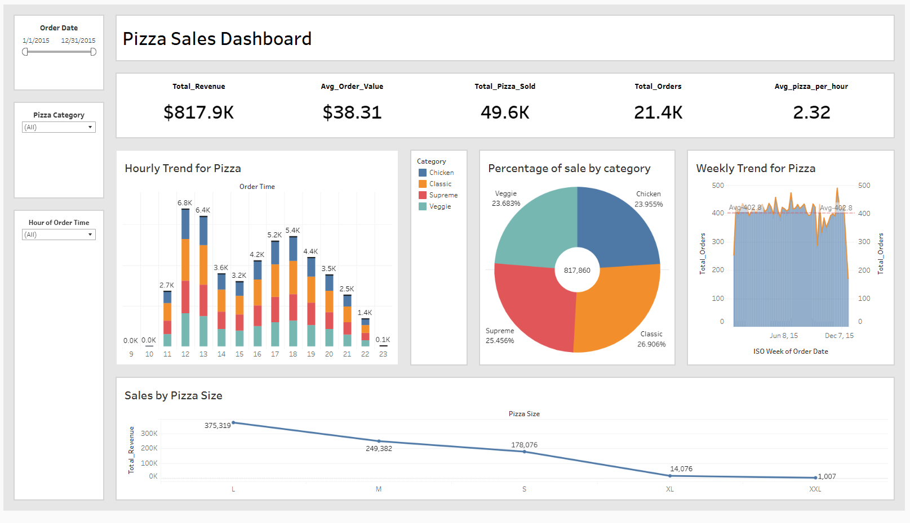

# 🍕 Pizza Sales Dashboard  

This interactive **Pizza Sales Dashboard** provides insights into pizza sales trends, revenue, and customer ordering patterns. It was built using **Tableau** for data visualization.  

## 📊 Dashboard Overview  

### **Key Metrics:**  
- **Total Revenue:** $817.9K  
- **Average Order Value:** $38.31  
- **Total Pizzas Sold:** 49.6K  
- **Total Orders:** 21.4K  
- **Average Pizzas Per Hour:** 2.32  

### **Visualizations:**  
✔️ **Hourly Trend for Pizza Sales** - Displays sales trends across different hours of the day.  
✔️ **Percentage of Sales by Category** - A pie chart showing the share of different pizza categories.  
✔️ **Weekly Trend for Pizza Sales** - Analyzes order trends on a weekly basis.  
✔️ **Sales by Pizza Size** - Compares total revenue generated by different pizza sizes.  

## 🖼️ Dashboard Preview  
  

## 🔗 View Interactive Dashboard  
[Click here to view on Tableau Public]([https://public.tableau.com/views/your-dashboard-name](https://public.tableau.com/views/PizzaSalesDashboard_17417628681100/Dashboard1?:language=en-US&:sid=&:redirect=auth&:display_count=n&:origin=viz_share_link))  

## 📂 How to Use  
1. Open the Tableau Public link above.  
2. Interact with filters (date, category, hour) to explore the data.  
3. Gain insights into pizza sales performance and trends.  

## 📌 Technologies Used  
- **Data Visualization:** Tableau  
- **Data Source:** [Specify Dataset or Source]  
- **File Format:** CSV  

📢 *Feel free to fork this repository and explore the dataset!* 🚀  
